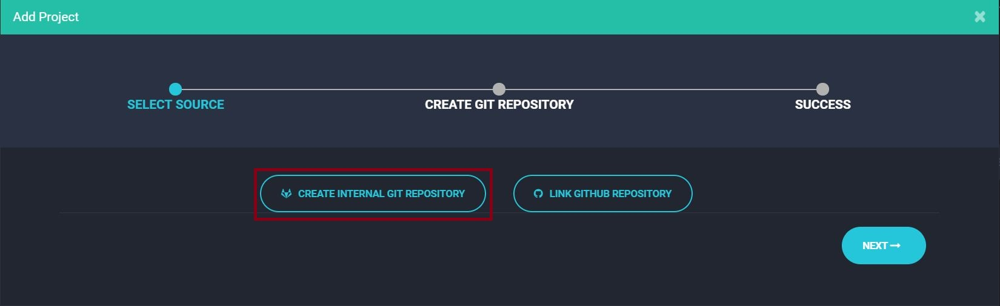
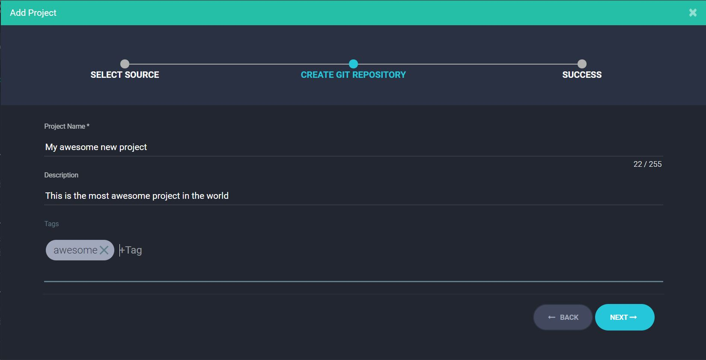

# Projects hosted by Clusterone

When creating a new project, you have the option to store the project code in a Git repository on the Clusterone servers. An unlimited number of free repositories comes with your account.

See [here](doc:code-on-clusterone) for an overview of other available options.

## Create a Project

### In the Matrix

Toggle the switch on the left side to show your projects. Click on the **Add Project** button in the center.


In the wizard, select **Create internal Git repository**.



On the next page, specify a project name. Optionally, you can add a description and choose tags. This is useful if you have many different projects that you want to group together.



In the last step, click **Add Project**. Success, you just created a new project on Clusterone!

### In the CLI

Creating a new project using the command line interface is as easy as:

```bash
just create project <project-name>
```

If you already have a local Git repository that you want to use for your project, you can use the `init` command instead of `create`. Navigate to your local Git repository. Then run:

```bash
just init project <project-name>
```

This adds Clusterone as a remote origin to your project. For linking a local repository to an existing project, see below.

See the [CLI Reference Manual](doc:just-cli-reference-manual) for more information on the [`just create project`](doc:just-create-project) and [`just init`](doc:just-init) commands.

## Link a local repository

Use the `ln` command of the CLI to link a local repository to an existing project. Change into the directory of your local Git repository. Now run:

```bash
just ln project -p <project-name>
```

This adds Clusterone as a remote origin to your project. See the [CLI Reference Manual](doc:just-cli-reference-manual) for more information on the [`just ln`](doc:just-ln) commands.

## Clone a repository

To clone a project repository, open the Matrix and navigate to the project you want to clone. Click the **Settings** tab. Find the Git URL and copy it to your clipboard. It should look similar to this: `https://git.clusterone.com/username/projectname.git`.

Now head over to your command line and run \(make sure to replace `<Git-URL>` with the URL you just copied\):

```bash
git clone <Git-URL>
```

To be able to push commits from this repository back to the Clusterone project, don't forget to link the repository.

## Push commits

Use the CLI to push new commits to a Clusterone project. Commit your code to your local repository like usual:

```bash
git add .
git commit -m "This is a commit"
```

Once your local Git repository is linked to Clusterone, all you need to do to push it is this:

```bash
git push clusterone master
```

