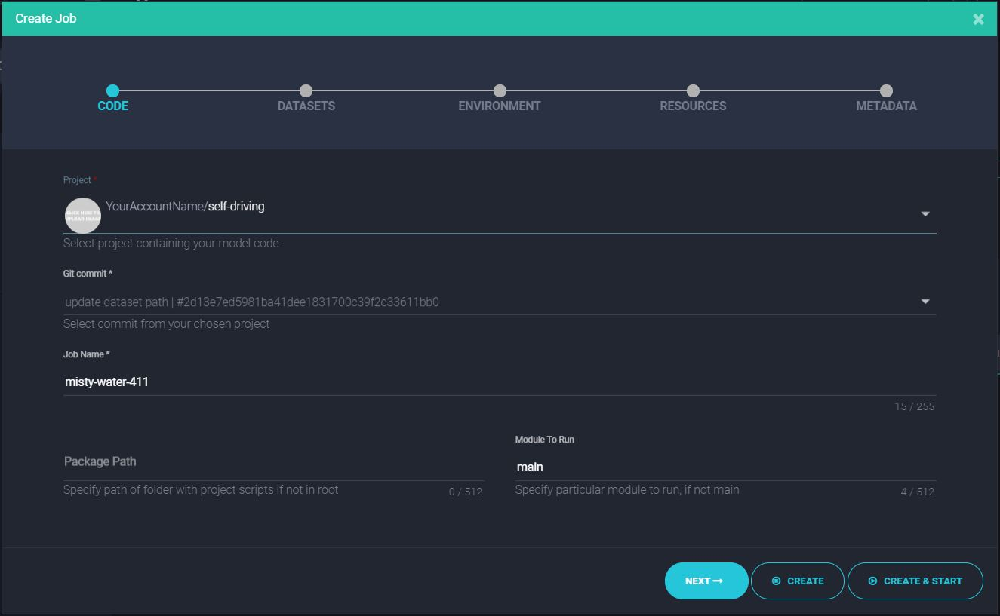
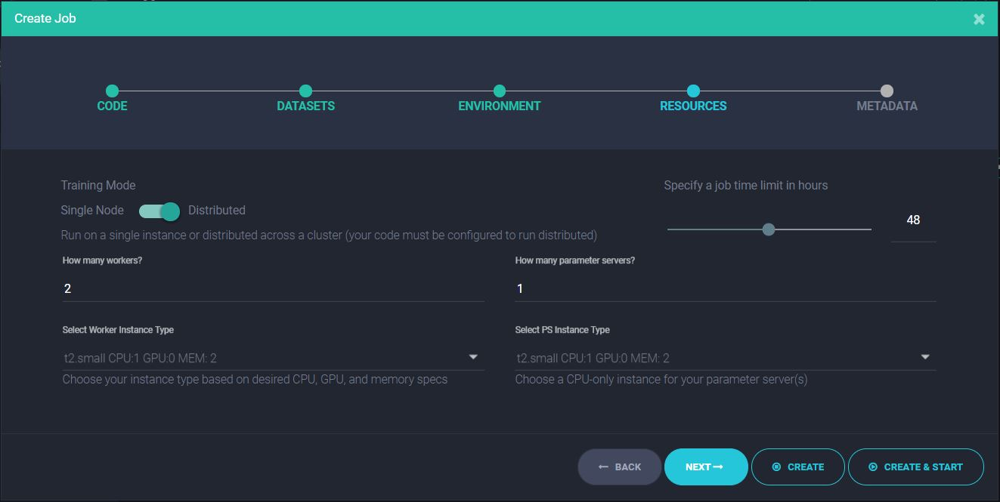

# Run a Job

You can start a job on Clusterone in two ways: using the `just` command line tool or through the [Matrix](https://clusterone.com/matrix), our graphical web interface, Both methods are outlined below.


* Jump to [creating a job from the command line](https://docs.clusterone.com/v1.0/docs/run-a-job#section-run-a-job-with-the-cli)
* Or log into the [Matrix](https://clusterone.com/matrix), click on your project and select "Create Job". Follow the instructions in the wizard.


## Run a Job with the CLI

Clusterone's command `just` allows you to create and run jobs from the command line:

```bash
just create job distributed --project YOUR_PROJECT_NAME \
--datasets YOUR_DATASET_NAME --module YOUR_MODULE_NAME --python-version 3 \
--framework tensorflow-1.0.0 --worker-type t2.small --ps-type t2.small \
--time-limit 1h
```

Let's go over the parameters:

* Here we are creating a distributed job, meaning that we're using multiple GPUs in parallel. If you'd rather run your code on a single machine, use `just create job single ...` instead.
* The `--dataset` parameter can accept multiple datasets if your code uses them. You can also omit it if you don't want to use any dataset.
* The `module` parameter is used to define which Python file Clusterone should execute. If this parameter is not provided, Clusterone assumes the file is called `main.py`. In the MNIST example, our module is called `mnist.py`, so we had to set `--module mnist`.
* Clusterone supports Python 2.7 and 3.5. For our example, we're using Python 3.5, indicated by the `--python-version 3` parameter.
* The `--framework-version` parameter tells Clusterone which machine learning framework and version it should use. We're opting for TensorFlow 1.0.0 in the example.
* By default, a distributed job uses 2 worker nodes and 1 parameter server. You can choose different numbers using the parameters `--worker-replicas` and `--ps-replicas`. See [here](doc:hardware-instance-types) for a list of available instance types.
* Finally, you can set a time limit for your job through the `--time-limit` parameter.

The `just create job` command has many more optional parameters to further customize your job. See the [reference manual](doc:just-create) for more information.

Now all that's left to do is starting the job you created. That is done like this:

```bash
just start job -p PROJECT_NAME/JOB_NAME
```

The `-p` parameter determines which job to start. Once the job is running, you can monitor it using `just pulse`.

## Run a Job Using the Matrix

Instead of using the command line, you can also run and manage jobs with Clusterone's graphical web interface, the [Matrix](https://clusterone.com/matrix).

Log into the Matrix with your Clusterone account. On the left side, you can see all your projects. The switch on the top left toggles the list to show your datasets.

To create a new job, select either your project or a dataset. Click on the "Create Job" button to open the job creation dialog.

Creating a job is divided into five short steps.

### Code

Specify the code you want to run on the first page of the Job wizard. Start by selecting which Project you want to run. Choose the project with our example that you created earlier.

Next, choose the version of the code you would like to run. The dropdown list shows all your Git commits to your project.

Clusterone has already created a name for your job, but you can rename it in the Job Name field.

In case your code has package dependencies that are not located in the root directory, you can add a search path for these packages in the Package Path field.

Finally, Clusterone requires you to specify the Python module it should run. By default, this is `main`. If your module is named differently, specify it here. For the MNIST example we are using in this guide, the module is called `mnist`.

When you're done, click the "Next" button to move on.



### Datasets

On the dataset page, select the dataset you want to use for the job. On the right, you can select the commit you would like to use.

Click the "Next" button when you're done.


### Environment

The environment page defines the Python environment that is used to run your project code.

Start by choosing the Python version that you wanted to use. Clusterone supports Python 2.7 and 3.5.

As a machine learning framework, Clusterone currently offers TensorFlow and PyTorch. The default value is TensorFlow version 1.0.0.

Clusterone further offers the choice two package managers - Pip and Anaconda. You can also define a requirements file for external package requirements.


### Resources

On the resources page, you can choose between single and distributed execution for your job. You can also define the number of workers and parameter servers, as well as their type of instance.

On the upper right, a bar specifies how many hours your job should run. When you're done, move on by clicking next.



### Metadata

The metadata page allows you to add a description to your job. When you're done, click "Create and Start".

And just like that, you have created and started a job on Clusterone. Congratulations!

