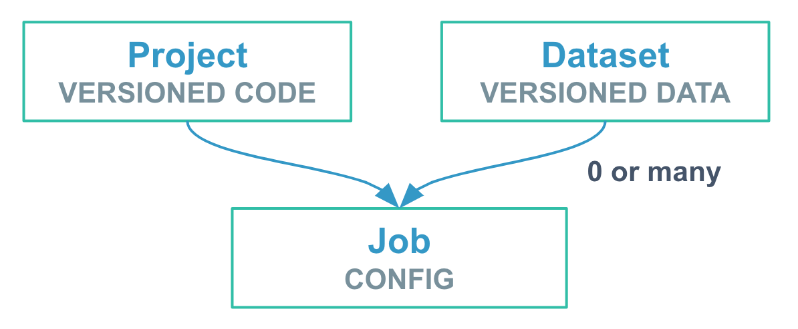
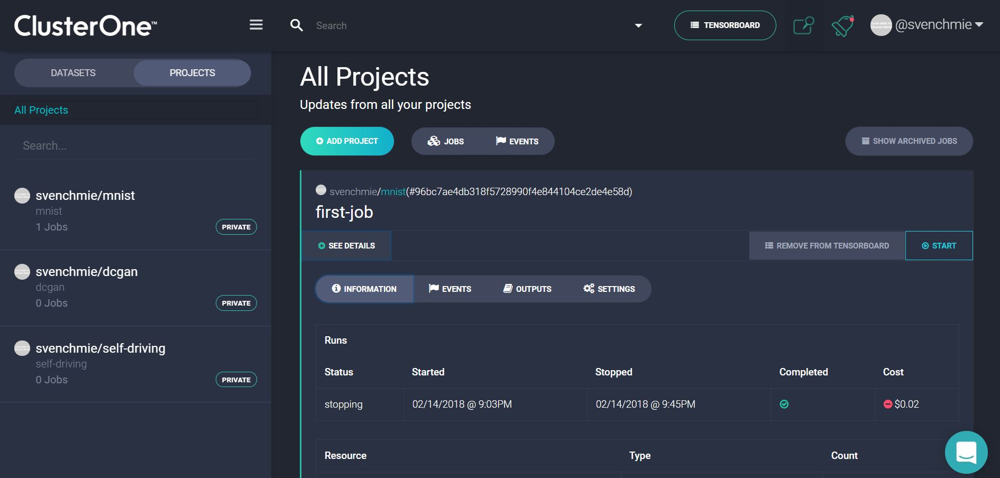

# System Overview

Clusterone is an online deep learning platform. You can easily import your existing code and data and get your project running on a distributed cluster in the cloud in minutes.

Let's have a quick look at how Clusterone is organized.

## Structure

There are three important entities on Clusterone: projects, datasets, and jobs.

* **Projects** contain your code stored in a Git repository.
* **Datasets** hold the training data you are feeding into your model.
* **Jobs** run the project code. Depending on the application, they can be provided with 0 to many datasets.

## User Interface

Clusterone offers a number of ways to interact with the platform.

### The Matrix

The [Matrix](https:www.clusterone.com/matrix) is Clusterone's graphical web interface. Here you can manage your projects and datasets, run jobs and check their progress. The Matrix also provides direct access to TensorBoard, making it easy to analyze your project's performance.

### The CLI

`just` is Clusterone's [command line interface](doc:just-cli-reference-manual). You have already used it on the first page of this guide. It is automatically installed when you get the Clusterone Python packages. Using `just`, you can create new projects and datasets and even run jobs directly from your command line.

### Web API

Finally, Clusterone offers an API that you can use to build your own application using Clusterone's job execution capabilities. Check out the [API reference manual](https://docs.clusterone.com/v1.0/reference) to learn more.

